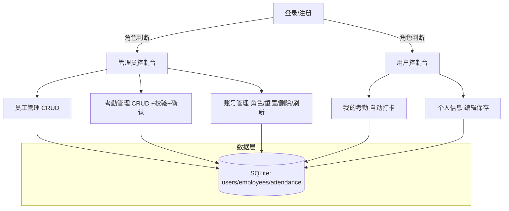

# 公司员工考勤管理系统 项目报告

## 研究背景
- 随着企业数字化转型与远程/弹性办公的普及，传统纸质或人工统计的考勤模式难以满足实时性、准确性与权限管理的需求。
- 面向对象程序设计课程要求学生在工程化场景中实践类、对象与模块化设计，本项目以企业考勤为真实业务场景，完成从数据到界面的完整实现。

## 研究意义
- 通过 JavaFX 桌面应用与 SQLite 本地数据库构建一套可用的员工考勤管理系统，覆盖登录注册、权限区分、员工与考勤的增删改查等核心能力。
- 强化面向对象建模与分层架构（Controller/Service/DAO/Model/UI），推进安全（BCrypt）、一致性（账号↔员工绑定）、可维护性（模块化）的综合实践。

## 需求分析（详细）
- 用户角色与权限
  - 管理员：管理员工档案、管理全员考勤、管理账号（角色变更、重置密码、删除、列表刷新）。
  - 普通用户：登录后进行“自动打卡”（上班/下班）、查看个人考勤、维护个人信息（与员工档案一一绑定）。
- 功能需求
  - 登录/注册：支持注册时选择角色；登录后基于角色进入对应控制台；默认管理员账号初始化。
  - 员工管理（管理员）：新增、编辑、删除、刷新员工；展示员工编号（employees.id）。
  - 考勤管理（管理员）：新增、编辑、删除、刷新考勤；展示员工编号（attendance.employee_id→employees.id）；保存与删除前二次确认；时间格式校验（HH:mm）。
  - 账号管理（管理员）：展示账号编号（users.id）、用户名、角色、注册时间；支持设为管理员/普通用户、重置密码、删除、刷新。
  - 我的考勤（用户）：自动打卡（记录当前系统时间，禁用手填）；根据规则自动判定“迟到/早退/正常”。
  - 个人信息（用户）：编辑并保存姓名、部门、职位、电话、入职日期、状态；与账号一一绑定（employees.user_id = users.id）。
- 数据一致性与迁移
  - 绑定关系：注册即创建员工档案并绑定；历史数据登录时自动迁移（若存在以“用户名=姓名”的旧记录则绑定，否则创建新档案）。
- 非功能需求
  - 安全：密码哈希存储（BCrypt），避免明文；删除账号级联清理员工与考勤。
  - 易用：中文界面与现代样式；表单校验与确认弹窗；Tab不可关闭以避免控件丢失。
  - 部署与构建：Maven 构建；JavaFX 插件运行；SQLite 无需额外服务。

## 系统功能结构（Mermaid）

## 数据存储设计（数据库表结构）
- users
  - id INTEGER PRIMARY KEY AUTOINCREMENT
  - username TEXT UNIQUE NOT NULL
  - password_hash TEXT NOT NULL
  - role TEXT NOT NULL
  - created_at TEXT NOT NULL
- employees
  - id INTEGER PRIMARY KEY AUTOINCREMENT
  - name TEXT NOT NULL
  - department TEXT
  - position TEXT
  - phone TEXT
  - hire_date TEXT
  - status TEXT
  - user_id INTEGER（登录后自动迁移/绑定；注册时新建并绑定）
- attendance
  - id INTEGER PRIMARY KEY AUTOINCREMENT
  - employee_id INTEGER NOT NULL（指向 employees.id）
  - date TEXT NOT NULL（ISO-8601：YYYY-MM-DD）
  - check_in TEXT（HH:mm）
  - check_out TEXT（HH:mm）
  - status TEXT（正常/迟到/早退/组合）
  - note TEXT

表创建与默认管理员初始化位置：`src/main/java/com/company/attendance/db/Database.java:20-77`

## 系统功能实现（模块逐一描述）

### 启动与场景管理
- 功能描述
  - 应用启动后加载登录场景，统一通过场景控制器切换各界面；引入统一样式表。
- 界面实现
  - 启动入口：`src/main/java/com/company/attendance/MainApp.java:8-20`
  - 场景控制器：`src/main/java/com/company/attendance/ui/SceneController.java:15-23`（加载 FXML、应用 CSS、设置 Scene）

### 登录与注册、角色区分
- 功能描述
  - 注册时创建用户账号并哈希密码；登录时验证密码，保存会话并根据角色跳转。
  - 登录后若未绑定员工档案，自动迁移或创建并绑定（保证 users.id ↔ employees.user_id 一致）。
- 界面实现
  - 登录控制器：`src/main/java/com/company/attendance/controller/LoginController.java:20-41`
  - 注册控制器：`src/main/java/com/company/attendance/controller/RegisterController.java:22-40`
  - 认证服务：注册 `src/main/java/com/company/attendance/service/AuthService.java:10-29`；登录与绑定 `src/main/java/com/company/attendance/service/AuthService.java:31-56`

### 会话管理
- 功能描述
  - 保存当前登录用户信息；支持退出登录时清空。
- 界面实现
  - 会话：`src/main/java/com/company/attendance/service/Session.java`（保存 currentUser）
  - 控制器退出登录：管理员 `src/main/java/com/company/attendance/controller/AdminDashboardController.java:218-223`；用户 `src/main/java/com/company/attendance/controller/UserDashboardController.java:165-170`

### 管理员：员工管理
- 功能描述
  - 新增、编辑、删除、刷新员工列表；展示“员工编号”（employees.id）。
- 界面实现
  - FXML：`src/main/resources/fxml/AdminDashboard.fxml`（“员工管理”Tab，表格与输入区）
  - 控制器：加载与 CRUD `src/main/java/com/company/attendance/controller/AdminDashboardController.java:86-129`
  - DAO：`src/main/java/com/company/attendance/dao/EmployeeDao.java:13-35` 列表；`37-52` 插入；`160-176` 更新；`178-189` 删除

### 管理员：考勤管理（含时间校验与二次确认）
- 功能描述
  - 新增/编辑考勤记录；保存前校验时间格式 HH:mm；保存/删除前二次确认；展示“员工编号”。
- 界面实现
  - FXML：`src/main/resources/fxml/AdminDashboard.fxml`（“考勤管理”Tab，表格与输入区、按钮）
  - 控制器：保存与校验/确认 `src/main/java/com/company/attendance/controller/AdminDashboardController.java:131-179`；删除确认 `182-190`；编辑加载 `198-207`
  - DAO：插入 `src/main/java/com/company/attendance/dao/AttendanceDao.java:13-28`；更新 `30-46`；列表 `48-70`；按员工列表 `72-95`；删除 `122-133`

### 管理员：账号管理
- 功能描述
  - 展示账号编号（users.id）、用户名、角色、注册时间；设为管理员/普通用户、重置密码、删除账号（级联清理其员工与考勤）、刷新列表。
- 界面实现
  - FXML：`src/main/resources/fxml/AdminDashboard.fxml`（“账号管理”Tab，表格与操作按钮）
  - 控制器：用户表初始化与操作 `src/main/java/com/company/attendance/controller/AdminDashboardController.java:75-83, 186-257, 260-267`
  - DAO：列表 `src/main/java/com/company/attendance/dao/UserDao.java:63-83`；角色更新 `85-96`；重置密码 `98-109`；删除账号级联 `111-128`

### 用户：我的考勤（自动打卡）
- 功能描述
  - 用户端仅允许“上班打卡/下班打卡”，自动记录当前时间与日期，禁用手动填写；依据规则自动判定状态（迟到/早退/正常）；合并状态不重复。
- 界面实现
  - FXML：`src/main/resources/fxml/UserDashboard.fxml`（“我的考勤”Tab，今日标签与打卡按钮、表格）
  - 控制器：上/下班打卡与状态计算 `src/main/java/com/company/attendance/controller/UserDashboardController.java:56-114`；表格刷新 `124-126`
  - DAO：查询当天记录 `src/main/java/com/company/attendance/dao/AttendanceDao.java:97-120`

### 用户：个人信息（员工档案绑定）
- 功能描述
  - 用户编辑并保存姓名、部门、职位、电话、入职日期、状态；以 `users.id` 查找并更新绑定的员工档案。
- 界面实现
  - FXML：`src/main/resources/fxml/UserDashboard.fxml`（“个人信息”Tab，表单与保存按钮）
  - 控制器：加载与保存 `src/main/java/com/company/attendance/controller/UserDashboardController.java:128-163`
  - DAO：按 user_id 查找与更新、插入绑定 `src/main/java/com/company/attendance/dao/EmployeeDao.java:98-120, 122-138, 140-145`

### 数据库初始化与默认管理员
- 功能描述
  - 首次运行创建表结构；若不存在 `admin` 用户则自动创建默认管理员 `admin/admin123`；检测并补充 `employees.user_id` 字段。
- 界面实现
  - 数据初始化：`src/main/java/com/company/attendance/db/Database.java:20-77`

### 安全加密
- 功能描述
  - 使用 BCrypt 对用户密码进行哈希存储与校验，防止明文泄露。
- 界面实现
  - 认证服务：`src/main/java/com/company/attendance/service/AuthService.java:10-29, 31-56`

### 样式与 UI
- 功能描述
  - 统一中文字体与现代化按钮样式；卡片式布局与阴影；禁用 Tab 关闭，避免控件丢失导致事件失败。
- 界面实现
  - 样式：`src/main/resources/styles/app.css`
  - Tab 禁用关闭：`src/main/resources/fxml/AdminDashboard.fxml` 与 `src/main/resources/fxml/UserDashboard.fxml`

### 构建与运行
- 依赖与插件
  - JavaFX：`org.openjfx:javafx-controls`、`javafx-fxml`
  - SQLite：`org.xerial:sqlite-jdbc`
  - BCrypt：`at.favre.lib:bcrypt`
  - 插件：`org.openjfx:javafx-maven-plugin`（运行）、`org.codehaus.mojo:exec-maven-plugin`（备用运行）
- 命令
  - 构建：`mvn -DskipTests=true clean package`
  - 运行（推荐）：`mvn javafx:run`
  - 运行（备用）：`mvn -DskipTests=true exec:java`

## 关系一致性与编号说明
- 账号编号（users.id）：在“账号管理”中展示为“账号编号”。
- 员工编号（employees.id）：在“员工管理”与“考勤管理”中展示为“员工编号”；考勤记录 `employee_id` 指向员工编号。
- 绑定关系：`employees.user_id = users.id`（注册即绑定；登录自动迁移/绑定旧数据）
- 用户侧所有数据操作均通过绑定的员工编号进行，编辑个人信息不会改变员工编号或账号编号。

## 质量与安全
- 密码哈希与验证：BCrypt；不存储明文。
- 删除账号级联清理：避免遗留“无主”记录。
- 表单校验与确认：管理员侧时间格式校验，保存/删除操作二次确认。

## 扩展建议
- 增加“未打卡自动标记缺勤”策略与提醒；可配置工作时段与节假日。
- 管理员可视化统计报表（部门/月度迟到早退分布），支持 CSV 导出。
- 在界面中增列显示“绑定员工编号/绑定账号编号”，更直观核对绑定关系。

---

# 附录：关键代码索引
- 数据库初始化与默认管理员：`src/main/java/com/company/attendance/db/Database.java:20-77`
- 认证注册：`src/main/java/com/company/attendance/service/AuthService.java:10-29`
- 认证登录与绑定迁移：`src/main/java/com/company/attendance/service/AuthService.java:31-56`
- 场景切换：`src/main/java/com/company/attendance/ui/SceneController.java:15-23`
- 登录控制器：`src/main/java/com/company/attendance/controller/LoginController.java:20-41`
- 注册控制器：`src/main/java/com/company/attendance/controller/RegisterController.java:22-40`
- 管理员员工 CRUD：`src/main/java/com/company/attendance/controller/AdminDashboardController.java:86-129`
- 管理员考勤保存/校验/确认：`src/main/java/com/company/attendance/controller/AdminDashboardController.java:131-179`
- 管理员考勤删除确认：`src/main/java/com/company/attendance/controller/AdminDashboardController.java:182-190`
- 管理员考勤编辑加载：`src/main/java/com/company/attendance/controller/AdminDashboardController.java:198-207`
- 账号管理操作：`src/main/java/com/company/attendance/controller/AdminDashboardController.java:75-83, 186-257, 260-267`
- 用户自动打卡（上/下班）：`src/main/java/com/company/attendance/controller/UserDashboardController.java:56-114`
- 用户个人信息加载/保存：`src/main/java/com/company/attendance/controller/UserDashboardController.java:128-163`
- AttendanceDao 插入/更新/查询：`src/main/java/com/company/attendance/dao/AttendanceDao.java:13-28, 30-46, 97-120`
- EmployeeDao 绑定/查找/更新：`src/main/java/com/company/attendance/dao/EmployeeDao.java:98-120, 122-138, 140-145, 147-158, 160-176`
- UserDao 列表/角色更新/重置/删除：`src/main/java/com/company/attendance/dao/UserDao.java:63-83, 85-96, 98-109, 111-128`

